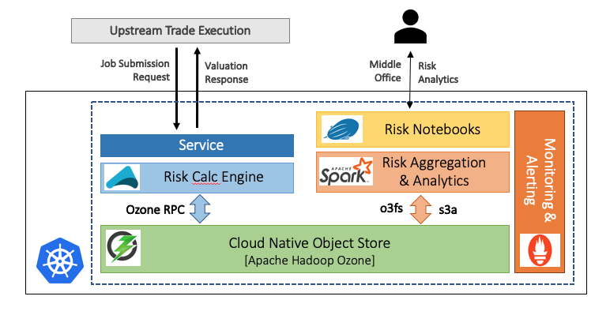
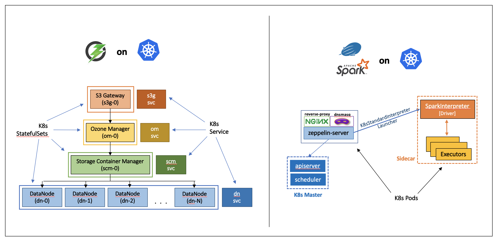
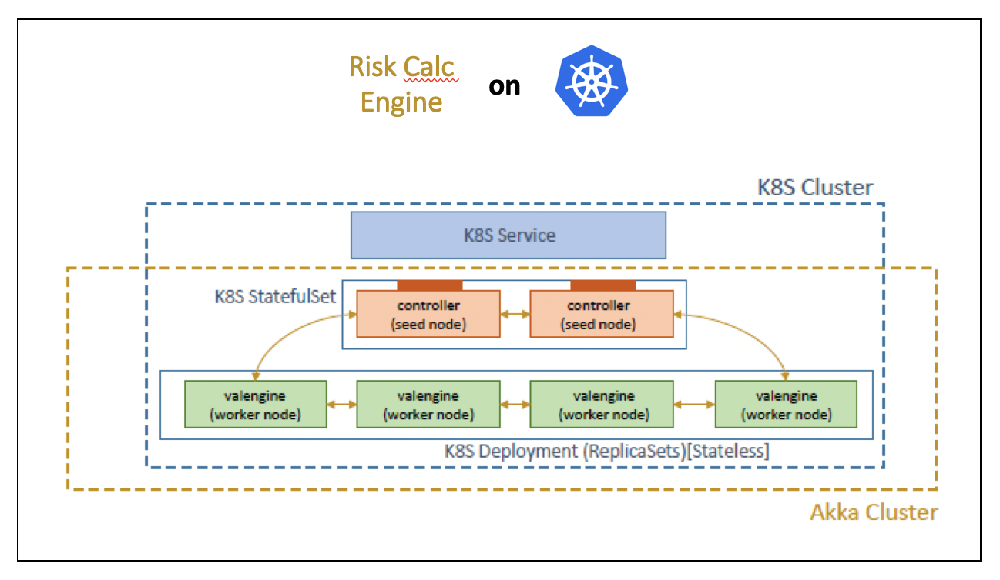

# Cloud Native Risk Analytics

Cloud native risk analytics application stack leveraging
 * _Risk Calc Engine_ built using Akka Cluster [as detailed here](https://github.com/amolthacker/hwx-pe-k8s-akka)
 * _Cloud Native Object Store_ in [Apache Hadoop Ozone](https://hadoop.apache.org/ozone/)
 * _Risk Aggregation and Analytics Engine_ using [Apache Spark](https://spark.apache.org/) on [Ozone]((https://hadoop.apache.org/ozone/))
 * _Analytics Notebooks_ using [Apache Zeppelin](https://zeppelin.apache.org/)

all running on [K8s](https://kubernetes.io/) equipped with [Prometheus](https://prometheus.io/) for metrics and monitoring.


## Architecture







## Tech Stack

|Tech | Version |
| --- | ------- |
|macOS | Mojave v10.14.3 |
|Minikube | 1.0.0 (VirtualBox 5.2.22) |
|Kubernetes | v1.14.0 |
|Helm | v2.13.1 |
|Prometheus | 2.6 (w/ prometheus-operator) |
|Skaffold | v0.26.0 |
|Apache Hadoop Ozone | 0.4-ozone (rev 8d1c2184283ab292b44022c55668cba00d885181) |
|Apache Spark | 3.0.0-SNAPSHOT (rev a15f17ce277e21d4a1e6b6018a2faea1549d5506) |
|Apache Zeppelin | 0.9.0-SNAPSHOT (rev 97c845a6f39e60d93a553d9b438bb11fb38e0497) |


## Prerquisites (for Mac)

```
see scripts/setup/install-utils-mac.sh
```

## Steps

1. Build the following project distributions and Docker images from source:
    
    a. Apache Hadoop Ozone 0.4 [[steps]](scripts/setup/build-hadoop.sh)

    *[OPTIONAL]*

    b. Apache Spark 3.0 [[steps]](scripts/setup/build-spark.sh) | [[prebuilt image - amolthacker/spark:3.0.0]](https://cloud.docker.com/repository/docker/amolthacker/spark/general)

    c. Apache Zeppelin 0.9 [[steps]](scripts/setup/build-zeppelin.sh) | [[prebuilt image - amolthacker/zeppelin:0.9.0-snapshot]](https://cloud.docker.com/repository/docker/amolthacker/zeppelin)

    d. `spark-ozone` image [[steps]](scripts/setup/build-spark-ozone-docker.sh) | [[amolthacker/spark-ozone:3.0.0]](https://cloud.docker.com/repository/docker/amolthacker/spark-ozone)


2. Install the built `hadoop-ozone` pom and jars in local maven repo
    ```
    $ ./scripts/common/setup-ozlib-mvn.sh
    ```

3. Build the `compute-engine` code and Docker image
    ```
    $ ./rebuild-app.sh
    ```

4. Spin up a Minikube cluster (GKE soon) and deploy `Hadoop Ozone` and the `compute-engine` app in K8s
    ```
    $ ./redeploy-minikube.sh
    ```

    The **script automates the following steps**:

    a. Spins up `minikube K8s` cluster

    b. Deploys `Helm`

    c. Deploys `Prometheus` and `Istio`

    d. Deploys `Hadoop Ozone` and initializes Ozone S3 bucket `valuations`

    e. Deploys the `compute-engine` app

    f. Deploys `Zeppelin`


    As the script executes, one should see the following:

    
    
    


5. Once the K8s infrastructure is up, one can forward service ports for access through local browser
    ```
    $ sudo kubefwd svc -n default
    ```
    

    One can now access the services as follows:

    | Service | URL     |
    | ------- | ------- |
    | Ozone Manager | http://om-public:9874 |
    | Ozone S3 Bucket Explorer | http://s3g-public:9878/valuations?browser=true |
    | Zeppelin | http://zeppelin-server/#/ |

    and K8s Dashboard
    ```
    $ minikube dashboard
    ```

    
    

6. One can submit `risk compute jobs` and have the `comput-engine` calculate risk metrics and persist them in `Ozone`
    ```
    $ ./scripts/submit-compute-batch
    Usage: ./scripts/common/submit-compute-batch 
        -t, --k8s-type    <mkube|gke|eks|aks>   : K8s Type
        -n, --num-jobs    <num_jobs>            : No.of Valuation Jobs
        -s, --compute-svc <compute_svc_address> : Compute Service DNS/PIP
        -h, --help                              : Help
    ```

    eg:
    ```
    $ ./scripts/common/submit-compute-batch -t mkube -n 10 -s 192.168.99.100:30309
    ```

    
    


7. Launch `Zeppelin` in the browser and import notebook `notebook/hwxpe.json`

8. Run the paragraphs for analytics on the computed risk metrics using `Spark on Ozone`

    
    